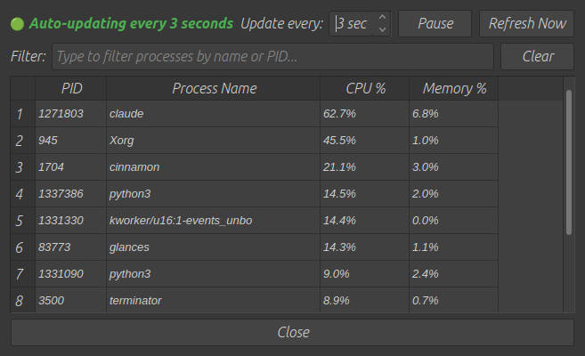
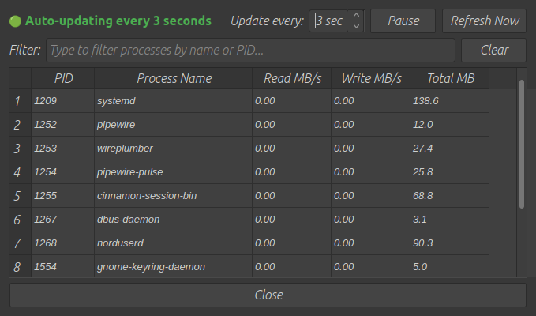
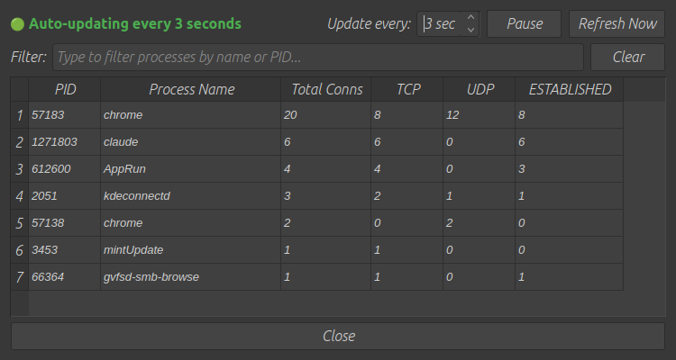

# SysMon - Real-time System Monitor

**Version:** v0.2.17c (Production Release)
**Release Date:** 2025-12-31

## Description
Comprehensive system monitoring application with real-time graphs for CPU, Disk I/O, and Network activity. Built with PyQtGraph for performance visualization.

## Features
- **Real-time monitoring** with smooth scrolling graphs (75-150x faster than matplotlib)
- **Real-time drill-down dialogs** for CPU, Disk I/O, and Network process analysis
  - Live-updating top 10 process lists with sortable columns
  - Adjustable update intervals (1-60 seconds, default 3s)
  - Process filtering by name or PID
  - Pause/Resume controls for snapshot analysis
- **Live memory display** showing RAM and Swap usage in real-time
- **Persistent graph preferences** including axis inversion direction (left-to-right or right-to-left)
- **Professional menu system** with File, Edit, View, Config, Help menus
- **Window transparency** for see-through mode (10%-100% opacity control)
- **Always On Top** toggle for floating desktop monitor
- **XDG compliance** for cross-platform configuration management
- **Cross-platform compatibility** (Windows, Linux, macOS)
- **Automatic system theme** detection (light/dark mode)
- **Window geometry persistence** with XDG-compliant configuration
- **Keyboard shortcuts** for power users (Ctrl+S, Ctrl+C, F11, etc.)

## Installation
### Requirements
- Python 3.7+
- PyQt5
- PyQtGraph
- psutil
- (matplotlib no longer required - replaced with PyQtGraph)

### Install Dependencies
```bash
pip install PyQt5 pyqtgraph psutil
```

### Alternative: Using Virtual Environment
```bash
python3 -m venv venv
source venv/bin/activate  # On Windows: venv\Scripts\activate
pip install PyQt5 pyqtgraph psutil
```

### Using requirements.txt
```bash
python3 -m venv venv
source venv/bin/activate  # On Windows: venv\Scripts\activate
pip install -r requirements.txt
```

### Run Application
```bash
# With virtual environment
source venv/bin/activate  # On Windows: venv\Scripts\activate
python3 src/sysmon.py

# Or directly (if dependencies installed globally)
python3 src/sysmon.py
```

## Usage
### Command Line Options
- `-s, --smooth-window`: Smoothing window size (1-20, default: 5)
- `-t, --time-window`: Time window in seconds (5-120, default: 20)

### Interactive Controls
- **Double-click on CPU graph**: Open real-time CPU process monitor
  - Shows: PID, Process Name, CPU %, Memory %
  - Updates every 3 seconds (adjustable 1-60s)
  - Sortable columns (click headers to sort)
  - Filter processes by name or PID
  - Pause/Resume for snapshot analysis

- **Double-click on Disk I/O graph**: Open real-time disk I/O monitor
  - Shows: PID, Process Name, Read MB/s, Write MB/s, Total MB
  - Delta-based rate calculation for accurate MB/s metrics
  - Tracks processes performing active disk operations

- **Double-click on Network graph**: Open real-time network monitor
  - Shows: PID, Process Name, Total Connections, TCP, UDP, ESTABLISHED
  - Protocol breakdown (TCP vs UDP connections)
  - Connection state tracking (ESTABLISHED, LISTEN)

- **Right-click on graph**: Access context menu (includes X-axis inversion option)
- **Config menu**: Time window settings, transparency, always-on-top
- **Keyboard shortcuts**: See Help → Keyboard Shortcuts for full list

## Screenshots

### Real-Time CPU Process Monitor


**Features**: Live CPU and memory usage for top 10 processes, sortable columns, process filtering, adjustable update intervals.

### Real-Time Disk I/O Monitor


**Features**: Read/Write MB/s rates with delta-based calculation, total cumulative I/O, tracks active disk operations.

### Real-Time Network Monitor


**Features**: Connection counts per process, TCP/UDP protocol breakdown, ESTABLISHED connection tracking.

## Configuration
Configuration files are stored in XDG-compliant locations:
- **Linux/macOS**: `~/.config/sysmon/` (config.json, preferences.json)
- **Windows**: `%APPDATA%\sysmon\` (config.json, preferences.json)

The configuration includes:
- **config.json**: Window geometry and position
- **preferences.json**: User settings (update interval, time window, transparency, always-on-top, axis inversion, graph colors)

## Version History
See [CHANGELOG.md](docs/CHANGELOG.md) for detailed version history.

## License
[License Name] - see [LICENSE](LICENSE) file for details.
